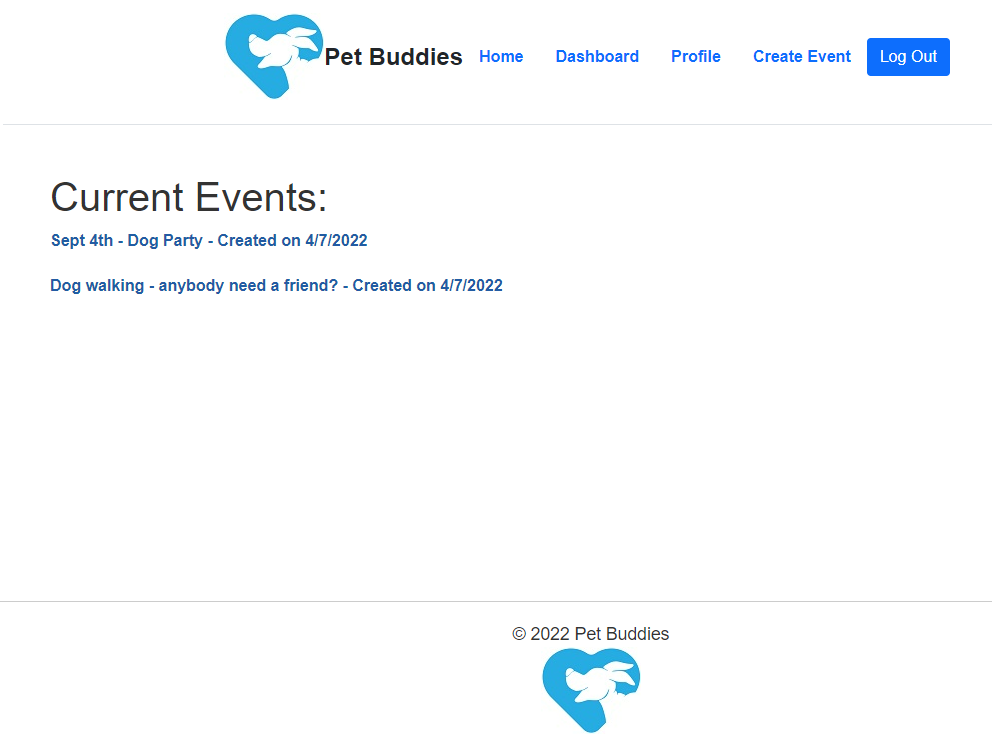
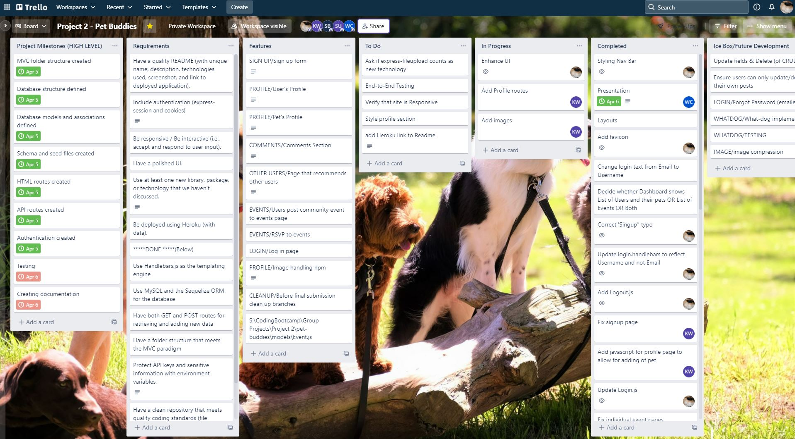

# <Your-Project-Title> Pet Buddies
## U of T Coding Boot Camp: Project 2
### [Description](#description)  - [User Story](#user-story)  -  [The Team](#the-team)  - [Technologies Used](#technologies-used) - [Snapshot](#snapshot)  - [Installation](#installation)  - [Links](#links) - [Installation](#installation) - [Credits](#credits)


## Description
We all love our pets and we want the best for them!
An important part of that livelihood is socialization
Here’s a service called Pet Buddies to find other owners and pets to meet!
- Users can share and post comments to pet profiles
- A page that lets you find other pets profiles
- An events page


## User Story
```
AS A pet owner
I WANT an easy way to find other pet owners in my area
SO THAT I can create opportunities to socialize my pets with theirs
```

## The Team
- Sevan B: Views
- William C: Front-End, Documentation
- Kenneth W: API Routes
- Somaiah U: Models
- Echeta O: Page Routes, UI


## Technologies Used
- HTML, CSS, Javascript
- Bootstrap
- Node.js, Express.js
- Express-fileupload
- Heroku
- MySQL
- MVC 
- Sequelize ORM
- Handlebars


## Snapshot


## Links
- GitHub Repo: https://github.com/KennWg/pet-buddies
- Deployed site on Heroku: https://sheltered-oasis-41495.herokuapp.com/

## Trello Board
https://trello.com/b/OOZj68iY/project-2-pet-buddies



## Credits
This is our second group project in the Coding Boot Camp provided by [The School of Continuing Studies, University of Toronto](https://learn.utoronto.ca/) and [Trilogy Education Services](https://www.trilogyed.com/). Thanks to Chris, German and Adam for all of their help during this project. 